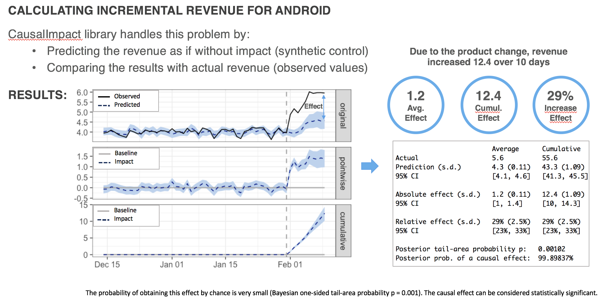
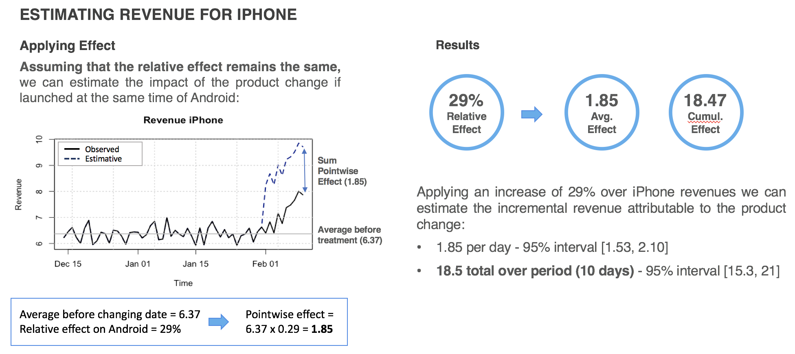

# Revenue Impact using Google's CausalImpact

Project designed to a confidential company that aims to calculate the incremental revenue due to an update in a product using Google's Causal Impact Library.

This project is relevant because it can be easily applied to other situations where A/B tests are not possible to be implemented like a global product change / product launch / marketing campaign 

Here are the steps of this study:

#### 1. Calculating impact of the product change
There is a change in an app on Android platform on Feb-01 that caused an increase in revenue. What is the impact of the update in revenue?

#### 2. Estimating impact if there were a change in iPhone
If the update were available to iPhone, what would be the impact in revenue, considering that the impact follows the same proportions.

* Due to confidentiality terms data is not available and the presentation was changed to anonymization purposes. 
